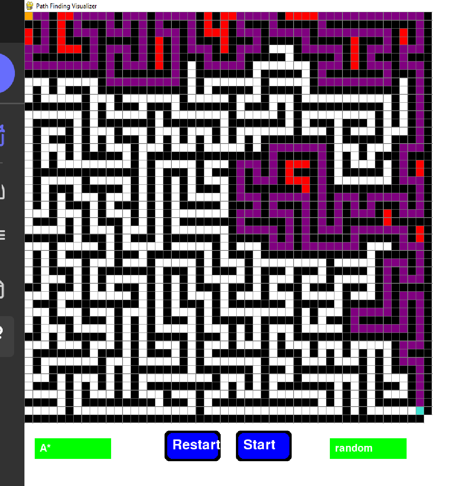

🔍 Pathfinding Visualizer
Welcome to the Pathfinding Visualizer project!

🛠️ Description
This tool is built with Python and Pygame to showcase how popular pathfinding algorithms work on a visual grid. Experiment with A*, Dijkstra's, BFS, and DFS algorithms, set your own start and end points, create barriers, and watch the pathfinding in action! 🌟

📸 Preview

🛠️ Features

    Interactive Grid: Place start/end nodes, barriers, and see paths appear in real-time!
    Algorithm Choices: Use the dropdown to switch between:
        🌟 A* (A-star)
        🔢 Dijkstra's Algorithm
        🔍 BFS (Breadth-First Search)
        🔍 DFS (Depth-First Search)
    Customizable Grid Size: Adjust the window for a larger or smaller grid as needed.

🚀 Getting Started
Prerequisites

    Python 3.x
    Pygame (pip install pygame)

Installation

    Clone the repository:

    bash

git clone https://github.com/your-username/pathfinding-visualizer.git
cd pathfinding-visualizer

Run the visualizer:

bash

    python pathfinding_visualizer.py

🎮 Usage

    Run the program and start with an empty grid.
    Select an algorithm from the dropdown menu.
    Click on the grid:
        Left-click to set start, end, or barriers.
        Right-click to clear cells.
    Press Start to execute the selected algorithm and watch it find a path!

🤖 Algorithms Implemented

    A* (A-star): Optimal and fast, uses heuristic to find shortest path.
    Dijkstra's: Guarantees shortest path without heuristics.
    BFS: Finds shortest path for unweighted grids.
    DFS: Explores all paths, not guaranteed to be shortest.

👷 Contributing

Pull requests are welcome! For major changes, please open an issue first to discuss your ideas.
📄 License

This project is licensed under the MIT License.

Happy pathfinding! 🎉
